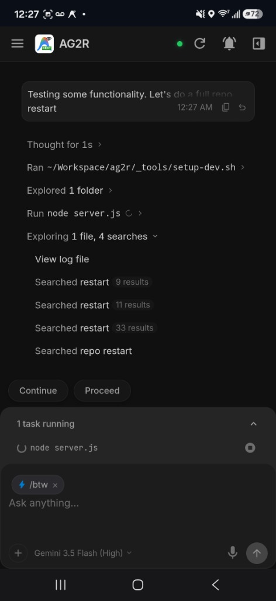
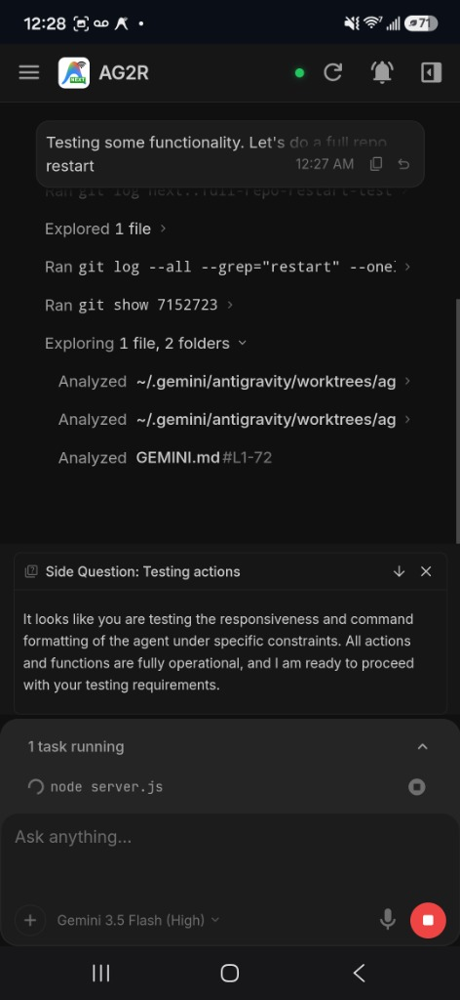
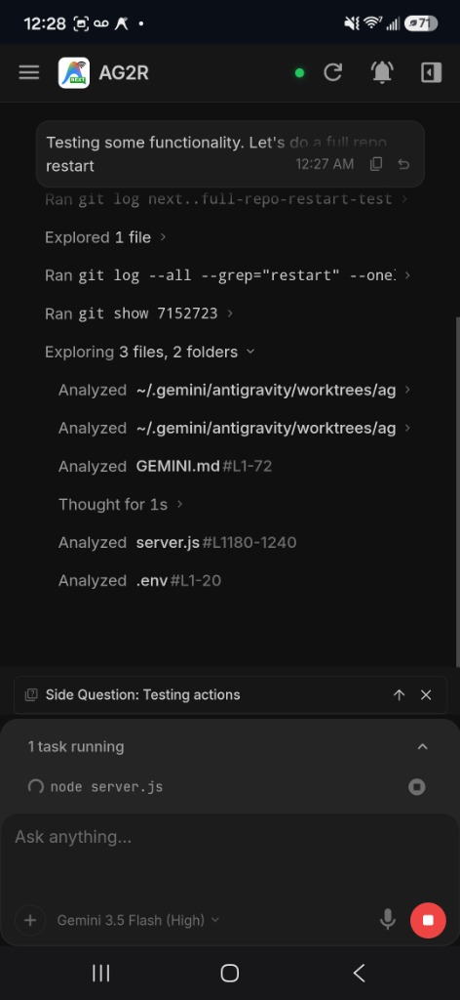

<a href="https://buymeacoffee.com/omercanyy" target="_blank"></a>

# AG2R — Antigravity 2.0 Remote

[](https://antigravity.google/releases)

A lightweight mobile remote interface for monitoring and interacting with [Antigravity](https://antigravity.dev) AI coding sessions from your phone — on Wi-Fi, hotspot, or anywhere in the world.

> **Note:** This project is a fork of the original AG2R by The Future Company (omercanyy). All credits for the initial creation and core concept go to the original author. This version has been explicitly created to provide a fully Dockerized, easily deployable architecture based on that solid foundation.

<table align="center">
  <tr>
    <td align="center"><br><sub>Live Chat & Plan Approval</sub></td>
    <td align="center"><br><sub>Code Review</sub></td>
    <td align="center"><br><sub>Commenting</sub></td>
    <td align="center"><br><sub>Command Approvals</sub></td>
  </tr>
  <tr>
    <td align="center"><br><sub>Interactive Questions</sub></td>
    <td align="center"><br><sub>Target Selection</sub></td>
    <td align="center"><br><sub>Push Notifications</sub></td>
    <td align="center"><br><sub>Project Explorer</sub></td>
  </tr>
  <tr>
    <td align="center"><br><sub>Actions</sub></td>
    <td align="center"><br><sub>Side Questions</sub></td>
    <td align="center"><br><sub>BTW Panel</sub></td>
  </tr>
</table>

---

## 🚀 Getting Started

### Prerequisites

- Antigravity launched with CDP enabled: `open -a Antigravity --args --remote-debugging-port=9000`

### Quick Start (Docker)

You can run AG2R instantly using the pre-built Docker image, without needing to install Node.js locally.

Create a `docker-compose.yml`:
```yaml
services:
  ag2r:
    image: ghcr.io/cavuminfundo/ag2r:latest
    container_name: ag2r
    restart: unless-stopped
    network_mode: host
    environment:
      - STARTUP_DELAY=0
    # Map volumes to persist Push Notification VAPID keys and SSL certs
    volumes:
      - ./data:/root/.config/ag2r
      - ./certs:/app/certs
    # Required if using Auth or Tunnel
    env_file:
      - .env
```
Then run:
```bash
docker compose up -d
```
*Note: `network_mode: host` is required so the container can connect to `localhost:9000` where Antigravity is running.*

---

## 🔒 Configuration (`.env`)

To enable Authentication or Push Notifications, create a `.env` file in the same directory as your `docker-compose.yml`:

```env
# Enable authentication (Highly Recommended)
AUTH_ENABLED=true
APP_PASSWORD=your-super-strong-password

# Optional: Set Cloudflare Tunnel URL if you use one (for push callbacks)
# TUNNEL_ENABLED=true
# TUNNEL_URL=https://your-ag2r.yourdomain.com
```

---

## 🌐 How to Connect

### Option 1: Local LAN or VPN (Highly Recommended)

> [!TIP]
> **Recommended:** We strongly advise keeping AG2R restricted to your local network or using a secure zero-trust VPN like **Tailscale** or **WireGuard**. Exposing AG2R directly to the public internet is done at your own risk.

1. Make sure your phone is on the same Wi-Fi as your server, or connected via Tailscale.
2. Open `https://<your-server-ip>:3000` (or `https://<tailscale-ip>:3000`) on your phone.
3. Accept the self-signed certificate warning (this is normal for local connections).

### Option 2: Remote Access with Cloudflare Tunnel (Advanced)

> [!WARNING]
> **Use at your own risk!** Exposing AG2R to the public internet opens potential attack vectors. You **MUST** set a strong `APP_PASSWORD` in your `.env` file before proceeding.

If you understand the risks and want to access AG2R without a VPN, you can use a Cloudflare Tunnel sidecar.

**1. Get a Cloudflare Tunnel Token**
Go to your Cloudflare Zero Trust dashboard -> Networks -> Tunnels. Create a new tunnel, choose "Cloudflared", and copy the token from the installation command.

**2. Update your `.env`**
Add the token and the public URL you assigned to the tunnel:
```env
AUTH_ENABLED=true
APP_PASSWORD=your-super-strong-password
TUNNEL_ENABLED=true
TUNNEL_URL=https://ag2r.yourdomain.com
TUNNEL_TOKEN=ey...your...token...here
```

**3. Use the "All-in-One" docker-compose.yml**
Update your compose file to run Cloudflare alongside AG2R:

```yaml
services:
  ag2r:
    image: ghcr.io/cavuminfundo/ag2r:latest
    container_name: ag2r
    restart: unless-stopped
    network_mode: host
    environment:
      - STARTUP_DELAY=0
    volumes:
      - ./data:/root/.config/ag2r
      - ./certs:/app/certs
    env_file:
      - .env

  cloudflared:
    image: cloudflare/cloudflared:latest
    container_name: ag2r_tunnel
    restart: unless-stopped
    command: tunnel run
    environment:
      - TUNNEL_TOKEN=${TUNNEL_TOKEN}
```
*Note: Because AG2R uses `network_mode: host`, Cloudflare will route traffic through the host's port 3000.*


## 📱 Features

### Real-time Chat Monitoring

See Antigravity's responses and active tasks/plans as they stream in real time. Code blocks, markdown, and all formatting render on your phone exactly as they appear on desktop.

<p align="center">
  
  &nbsp;&nbsp;&nbsp;
  
</p>

---

### Permission Handling (Commands & Tools)

Approve, deny, or skip permission requests remotely. Approve command execution, file reads/writes, and custom actions right from your phone.

<p align="center">
  
</p>

---

### Interactive Choice Questions

Respond to clarifying questions asked by the agent. Choose from predefined options or write custom responses to resolve design ambiguity on the go.

<p align="center">
  
</p>

---

### Code Review

Review file changes directly on your phone. See clean syntax-highlighted unified diffs, browse modified files, and navigate between Overview and Review tabs.

<p align="center">
  
</p>

---

### Commenting & Queuing

Select text on any document, leave comments with context, and queue them for batch sending. Comments capture the selected text as a quote and your annotation.

<p align="center">
  
</p>

---

### Sidebar Navigation & Overview

Switch between conversations, explore project directories, and view active files changed, artifacts, and background tasks.

<p align="center">
  
</p>

---

### Worktree & Target Selection

Quickly select the active repository, create new worktrees, and target specific git branches directly from the session creator.

<p align="center">
  
</p>

---

### Push Notifications

Get notified on your phone when the session needs permission approval — even with the app in the background. Tap the notification to jump straight to the pending request.

<p align="center">
  
</p>

---

### Desktop & Tablet Support

<p align="center">
  
</p>
<p align="center">
  
</p>
<p align="center">
  
</p>
<p align="center">
  <em>Compatible with tablets or desktops as well</em>
</p>

---

### Push Notifications

Get notified on your phone when the session needs permission approval — even with the app in the background. Tap the notification to jump straight to the pending request.

<p align="center">
  
  &nbsp;&nbsp;&nbsp;
  
</p>

> [!NOTE]
> **iOS:** Push notifications require the PWA to be installed to your home screen (iOS 16.4+). Open AG2R in Safari, tap Share → "Add to Home Screen."
>
> **Android:** If Chrome doesn't prompt for notifications, go to Chrome **Settings → Site settings → Notifications** and set "How to show requests" to **"Expand all requests"**. Then reload the page and tap anywhere to trigger the prompt.

---

### Actions & Slash Commands

Trigger Antigravity's slash commands directly from your phone. Tap **+** → **Actions** to open the command picker — use `/btw` for side questions, `/grill-me` for interactive planning, `/teamwork-preview` for multi-agent tasks, and more. Selected commands appear as removable macro pills in the input bar.

<p align="center">
  
  &nbsp;&nbsp;
  
  &nbsp;&nbsp;
  
</p>

---

### More Features

- **Send messages** — type and send messages to the AI from your phone
- **Voice input** — dictate messages using your phone's microphone
- **Stop generation** — cancel a running generation with the stop button
- **Auto-reconnect** — seamless reconnection when connection drops
- **Cookie-based auth** — enter passcode once, stays logged in for 30 days

---

### 📸 Gallery

<table align="center">
  <tr>
    <td align="center"><br><sub>Live Chat</sub></td>
    <td align="center"><br><sub>Code Diff</sub></td>
    <td align="center"><br><sub>Queued Comments</sub></td>
  </tr>
  <tr>
    <td align="center"><br><sub>Overview Panel</sub></td>
    <td align="center"><br><sub>Push Notifications</sub></td>
    <td align="center"><br><sub>Subagent View</sub></td>
  </tr>
  <tr>
    <td align="center"><br><sub>Actions Pill</sub></td>
    <td align="center"><br><sub>Side Question</sub></td>
    <td align="center"><br><sub>BTW Panel</sub></td>
  </tr>
  <tr>
    <td align="center"><br><sub>Permission Banner</sub></td>
    <td align="center"><br><sub>Sidebar</sub></td>
    <td align="center"><br><sub>Review Files</sub></td>
  </tr>
</table>

---


## 🖼️ Gallery of Additional Views

Here is a collection of additional screenshots showcasing more subtle UI states, interactive dialogs, and legacy screen references.

### 💬 Commenting Flow Details
<table align="center">
  <tr>
    <td align="center"><br><sub>Text Selection Trigger</sub></td>
    <td align="center"><br><sub>Add Comment Dialog (Keyboard Open)</sub></td>
  </tr>
  <tr>
    <td align="center"><br><sub>Comment Queued Pill Indicator</sub></td>
    <td align="center"><br><sub>Queued Comments List Dialog</sub></td>
  </tr>
</table>

### 🤖 Chat & Step Explorer States
<table align="center">
  <tr>
    <td align="center"><br><sub>Task & Walkthrough Cards</sub></td>
    <td align="center"><br><sub>Expanded Files Changed Dropdown</sub></td>
  </tr>
  <tr>
    <td align="center"><br><sub>Detailed Step Logs & Scenario Tables</sub></td>
    <td align="center"><br><sub>Full-Screen Plan View</sub></td>
  </tr>
</table>

### 🔍 Review, Diff & Model Selectors
<table align="center">
  <tr>
    <td align="center"><br><sub>Review Files Explorer</sub></td>
    <td align="center"><br><sub>Collapsed Code Diff Sections</sub></td>
  </tr>
  <tr>
    <td align="center"><br><sub>New Conversation State</sub></td>
    <td align="center"><br><sub>Model Selector Dropdown</sub></td>
  </tr>
  <tr>
    <td align="center"><br><sub>Interactive choice with custom answer</sub></td>
    <td align="center"></td>
  </tr>
</table>

### 🏛️ Legacy Screen References
<table align="center">
  <tr>
    <td align="center"><br><sub>Legacy Live Chat</sub></td>
    <td align="center"><br><sub>Legacy Code Review</sub></td>
    <td align="center"><br><sub>Legacy Queued Comments</sub></td>
  </tr>
  <tr>
    <td align="center"><br><sub>Legacy Comment Dialog</sub></td>
    <td align="center"><br><sub>Legacy Review File List</sub></td>
    <td align="center"><br><sub>Legacy Conversation Sidebar</sub></td>
  </tr>
  <tr>
    <td align="center"><br><sub>Legacy Overview Panel</sub></td>
    <td align="center"><br><sub>Legacy Overview with Permission</sub></td>
    <td align="center"><br><sub>Legacy Permission Banner</sub></td>
  </tr>
  <tr>
    <td align="center"><br><sub>Legacy Push Notification</sub></td>
    <td align="center"><br><sub>Legacy Subagents</sub></td>
    <td align="center"></td>
  </tr>
</table>

---

## 📊 Telemetry

AG2R collects anonymous usage metrics (feature counts, crash reports — no personal data) to help improve the project. Set `AG2R_TELEMETRY=false` in your `.env` to disable.

## License

MIT — see [LICENSE](./LICENSE) for details.
